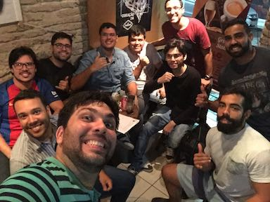
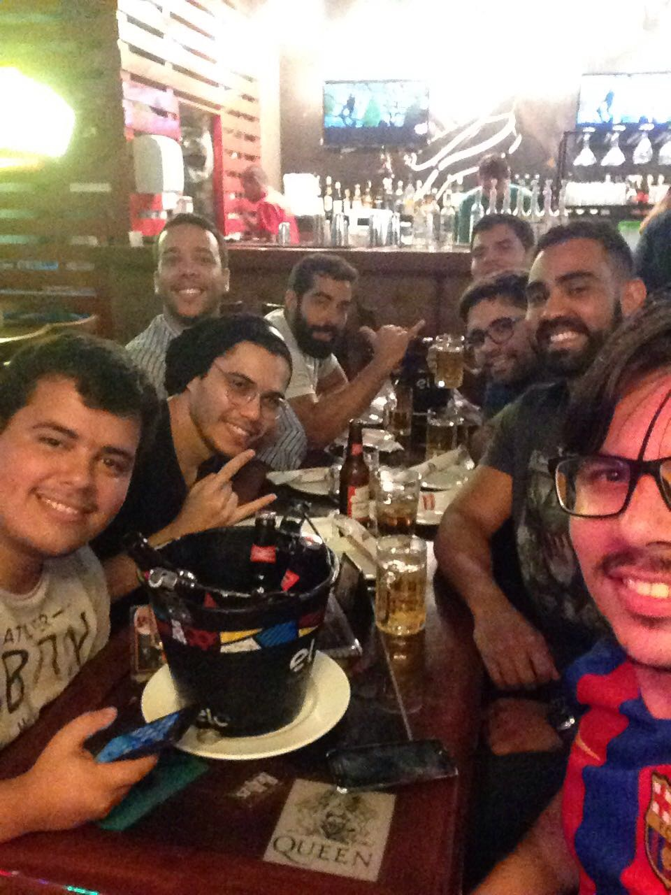

# Recife 

Bem vindos ao BeerJS/Recife. https://beerjs.github.io/recife/

A proposta da nossa comunidade é reunir desenvolvedores que compartilhem as mesmas paixões, isto é, cerveja e javascript (e não importa se você utiliza o js como linguagem principal ou auxiliar, se você é front-end ou back-end). Temos como objetivo, criar um espaço onde as pessoas possam compartilhar suas experiências sobre tecnologia, discutir tendências, frameworks, séries, mundo geek, (etc..) e ao mesmo tempo se divertir com boas músicas, bons papos e cerveja!

É importante lembrar que não importa seu nível, você será sempre bem vindo (desde que esteja disposto a colaborar sempre). Para nós, o importante é que todos tenham em mente que estamos aqui para aprender juntos, crescer juntos! E desta forma, pregamos o respeito mútuo entre os integrantes da comunidade, ou seja, não importa se você é um arquiteto ou um estagiário, aqui todos tem o mesmo valor.

<b>Nossos meetups são organizados pelos próprios participantes, mas nós estamos sempre procurando patrocinadores. Se você gostaria de comprar pizza ou cerveja ou hospedar um BeerJS em seu escritório ou estabelecimento, entre em contato!</b>

## Próximos Eventos

| Data e Horário | Local |  |
|:-:|:-:|:-:|
| TBD | [Apolo Beer Café](https://www.facebook.com/apolobeercafe) - Rua do Apolo 164 - Recife Antigo | 

## Eventos Passados
| Data e Local | Fotos |
|:-:|:-:|
| 16/03/2017 em [Apolo Beer Café](https://www.facebook.com/apolobeercafe) |  

## Stickers
Aguarde, em breve disponibilizaremos stickers para download e compras! :)

## Redes Sociais
 

<i>Slack: canal #recife</i>

## Código de Conduta
Acesse nosso código de conduta clicando [aqui](https://github.com/beerjs/recife/blob/master/Citizen%20Code%20of%20Conduct)

## Organizadores

| Organizer/Admin | Organizer/Admin | Organizer/Admin | Organizer | Organizer | Organizer |
|:-:|:-:|:-:|:-:|:-:|:-:|
|  |  |  |  |  | 
| [Victor Laerte](http://www.victorlaerte.com) | [Adriano Interaminse](https://github.com/interaminense) | [Jordana Morais](https://github.com/jordanamorais) | [Danilo Novelino](https://github.com/DaniloNovelino) | [Paulo Amorim](https://github.com/paulorec) | [Alex Pessoa](https://github.com/alexpessoajr) |

<i>Sinta-se a vontade para adicionar sua foto :) </i>

<i>Nota: beer.js é sobre a criação de espaços sociais para fortalecer as comunidades de software. Não há necessidade de beber para participar.</i>
